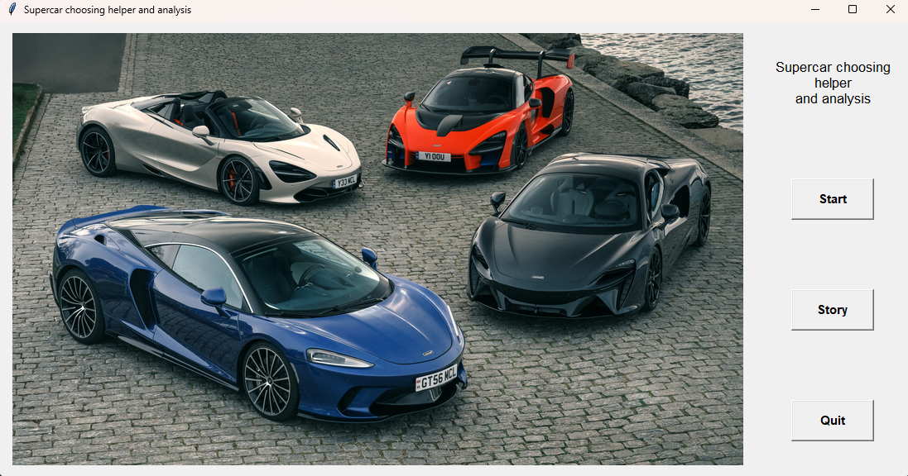
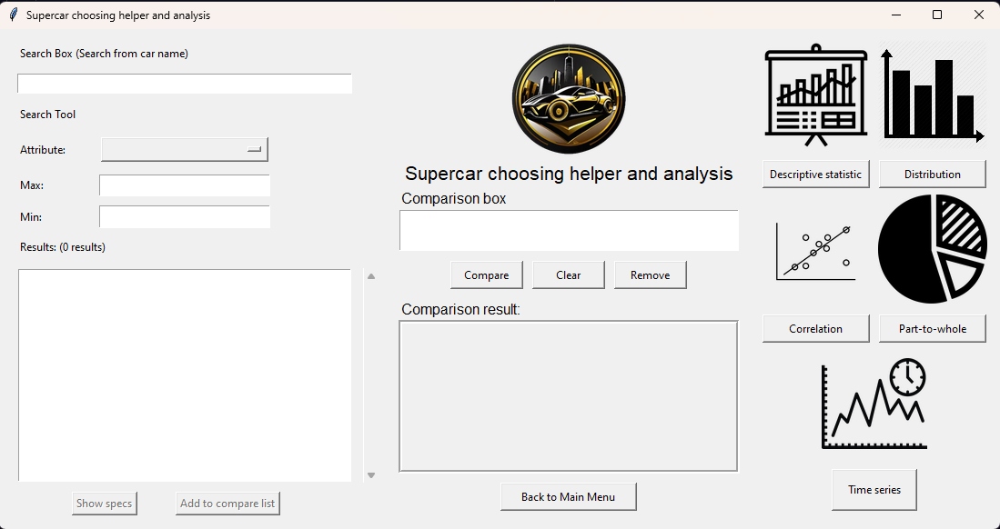

# Supercar choosing helper and analysis 🏎️
This project will create the supercar choosing helper and analysis to 
help users make a decision about the supercar or see information about the supercar.
By showing descriptive statistics and graphs based on user's input.
## Main features 📃
- Users can search for cars by brand or model.
- Users can see the data storytelling page.
- Users can search for cars by filtering car specs.
- Users can see information about selected cars.
- Users can see descriptive statistics of all attributes.
- Users can see a distribution graph of selected attributes.
- Users can see a correlation graph between selected attributes.
- Users can see a part-to-whole graph.
- Users can see a time-series graph of selected attributes.
- Users can select multiple cars to compare and see results.


## Screenshots of application 📸
### Startup window

### Main window

## How to install and run the program 💻
### Required python version 
Required python version >= 3.11
### Requirements
- `Pillow`: Pillow is a Python library for image processing tasks like opening, manipulating, and saving various image file formats.
- `matplotlib`: Matplotlib is a comprehensive graph plotting library for Python.
- `numpy`: NumPy is a Python library for numerical computations, offering arrays and mathematical functions.
### Data
Data download link: [Link to data source](https://www.kaggle.com/datasets/rkiattisak/sports-car-prices-dataset)
### Installation and run
1. Clone the project
```
git clone https://github.com/gooddinosaur/supercar-project.git
```
2. Navigate to the project directory
```
cd supercar-project
```

3. Install the requirements
```
pip install -r requirements.txt
```

4. Run the project
```
python supercar_app.py
```
## Links to wiki 📖
- [Homepage](https://github.com/gooddinosaur/supercar-project/wiki)
- [Project Proposal](https://github.com/gooddinosaur/supercar-project/wiki/Project-proposal)
- [UML and Sequence Diagrams](https://github.com/gooddinosaur/supercar-project/wiki/UML-and-Sequence-Diagrams)

